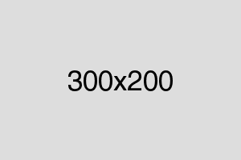

# 前端代码规范

## 概述

本前端代码规范是由 [三体云动](https://www.styd.cn/) ⬀ 前端团队整理的，基于 [W3C](http://www.w3.org/) ⬀、[Google开发者](https://developers.google.com/style/) ⬀ 等官方文档，并结合团队日常业务需求以及团队在日常开发过程中总结提炼出的经验而制定。

★ 核心目标：

1. 增强团队开发协作、提高代码质量、可读性和维护性
2. 表现、内容和行为的分离
3. 标记结构良好、语义正确、普遍合法

以下规范是团队基本约定的内容，必须严格遵循。

[文件命名规范](./#wen-jian-ming-ming-gui-fan)

从 `图片`、`HTML/CSS文件`、`脚本文件` 的命名等层面约定规范团队的命名习惯，增强团队代码的可读性。

[图片规范](./#tu-pian-gui-fan)

了解各种图片格式特性，根据特性制定图片规范，旨在从图片层面优化页面性能。

[HTML 规范](./#html-gui-fan)

使 HTML 代码风格保持一致，容易被理解和被维护。

[CSS 规范](./#css-gui-fan)

统一规范团队 CSS 代码书写风格和使用 CSS 预编译语言语法风格，提供常用媒体查询语句和浏览器私有属性引用，并从业务层面统一规范常用模块的引用。

[JavaScript 规范](./#javascript-gui-fan)

统一团队的 JS 语法风格和书写习惯，减少程序出错的概率，其中也包含了 ES6 的语法规范和最佳实践。

[字体规范](./#zi-ti-gui-fan)

统一系统字体和图标字体的引用规范。

## 文件命名规范

★ 核心目标：

1. 统一文件名称
2. 优化目录结构

因个人习惯引起的文件命名不统一，增加不同成员维护项目成本。所有命名类规范基本参照 [BEM](https://en.bem.info/methodology/quick-start/) ⬀方法，连字符或大小写等各有要求，请详细阅读。

### 图片文件

图片命名建议按照以下顺序命名，**中间用 "\_" 下划线连接**：

**图片功能类别\(必选\) + 图片模块名称\(必选\) + 辅助修饰名称\(可选\)**

* 图片功能类别：
  * mod\_\*：是否公共，可选
  * icon\_\*：图标
  * logo\_\*：LOGO类
  * spr\_\*：雪碧图
  * btn\_\*：按钮类
  * bg\_\*：背景类
* 图片模块名称
  * courselist：课程列表
  * courseinfo：课程信息
  * useravatar：用户头像
* 辅助修饰名称：
  * 高清图：2x \| 3x
  * 固定尺寸（宽 x 高）：200x100
  * 序号：1 \| 2 \| 3 \| ∞

⚑ 例：

```text
公共模块：
mod_btn_courselist.png
mod_icon_useravatar_2x.png
mod_bg_courseinfo_200x200.png

非公共模块：
btn_courselist.png
icon_useravatar_2x.png
bg_courseinfo_200x200.png
```

### HTML 文件

包括所有视图文件。

**文件命名总是以字母开头而不是数字，且字母一律小写，以下划线连接且不带其他标点符号**

⚑例：

```text
视图文件:
index.html
product_info.tpl
app.vue
```

### CSS / LESS 文件

CSS命名规范请参照 [HTML文件](./#html-wen-jian)，LESS稍有不同。

在LESS文件中，**库文件和无需编译生成的文件，在开头用下划线标记**。

⚑例：

```text
css:
index.css
main.css

less:
_button.less
_typography.less
index.less
```

### 脚本文件

按以下顺序，类型用 “.” 连接，名称用 “\_” 下划线连接。

**库类型\(可选\) + 功能名称\(必选\) + 打包状态\(可选\) + 压缩类别\(可选\) + 修饰\(可选\)**

* 库类型：
  * jquery.\*
  * mootools.\*
  * dojo.\*
* 功能名称：
  * album.\*
  * album\_list.\*
* 打包状态：
  * full.\*
  * package.\*
  * bundle.\*
  * all.\*
* 压缩类别：
  * min.\*
* 修饰：
  * \*.map

⚑例：

```text
脚本文件：
jquery.lightbox.js
jquery.lightbox.min.js
plupload.full.min.js
bootstrap.min.js.map
album_list.js
```

## 图片规范

★ 核心目标：

1. 规范图片格式
2. 优化图片质量
3. 减少加载耗时

### 格式

常见的图片格式有 GIF、PNG8、PNG24、JPEG、WEBP、SVG，根据图片格式的特性和场景需要选取适合的图片格式。

* 颜色丰富图片，且有透明通道，优先推荐使用 PNG 格式
* 动图和颜色单一，推荐使用 GIF 格式
* UGC - 用户行为产生的图片，如用户上传的内容，推荐使用 JPEG 格式
* 颜色唯一的icon，推荐使用 `webfont`，详细见 [字体规范](./#zi-ti-gui-fan)

为减少 HTTP 请求，而衍生出的 Css Sprites 和 Base64 技术，建议按照以下方式处理：

**Css Sprites 说明：**

* 适合使用频率高、更新频率低、颜色丰富的小图标
* 尽量不留太多的空白
* 体积较大的图片不合并
* 确保要合并的小图坐标数值和合并后的 Sprites 图尺寸均为偶数

**Base64 说明：**

* 适合更新频率高的小图片，如某些具备自定义功能的标题icon等
* 转换成 Base64 编码的图片应小于 2KB
* **移动端不使用 Base64 编码**

### 大小

网站响应时间中，图片资源消耗占据 ≥30%，图片大小需受到严格控制。

**所有图片必须经过一定的压缩和优化才能发布**

* PNG 图片使用 [Tinypng](https://tinypng.com/) ⬀ 压缩
* JPEG 导出前选择质量范围在 60 ~ 75

PC 端单张图片不能 ＞300kb

移动端单张图片不能 ＞100kb

### 尺寸

**所有图片尺寸必须为偶数**。如：100x50，400x400，122x58。

可以使用 [七牛图片API](https://developer.qiniu.com/dora/manual/3683/img-directions-for-use) ⬀ 功能对用户上传图片进行裁剪显示，裁剪结果也必须为**偶数**。

⚑例：

```text
原始图片：
https://pic3-s.styd.cn/o_1b4iam0mh54bvrn1qcgsa5gr67.jpg

裁剪后图片：
https://pic3-s.styd.cn/o_1b4iam0mh54bvrn1qcgsa5gr67.jpg?imageView2/1/w/200/h/200/
```

### 引入方式

测试内容图应该标明图片尺寸，[在线生成占位图](https://dn-placeholder.qbox.me/) ⬀。

⚑例：

```text
https://dn-placeholder.qbox.me/300x200
```



## HTML 规范

### 代码规范

★ 核心目标：

1. 遵循 HTML 标准和语义
2. 减少标签数量和嵌套
3. 代码风格保持一致
4. 提高效率及协同开发的便捷性

#### 缩进

用两个空格来代替 tab

```markup
<!DOCTYPE html>
<html lang="en">
<head>
  <meta charset="UTF-8">
  <title>Document</title>
</head>
<body>
  <h1>这个DEMO</h1>  
</body>
</html>
```

#### doctype

为每个 HTML 页面的第一行添加标准模式（standard mode）的声明，这样能够确保在每个浏览器中拥有一致的展现。统一使用 HTML5 的文档声明：

```markup
<!DOCTYPE html>
```

#### 字符编码

以 UTF-8 无 BOM 编码作为文件格式，BOM 介绍请参考 [「附录 - 文档 - 第 2 条 」](./#wen-dang)

```markup
<meta charset="UTF-8">
```

#### IE 兼容模式

IE 支持通过特定的 `<meta>` 标签来确定绘制当前页面所应该采用的 IE 版本。除非有强烈的特殊需求，否则最好是设置为 **edge mode**，从而通知 IE 采用其所支持的最新的模式。

```markup
<meta http-equiv="X-UA-Compatible" content="IE=Edge">
```

#### 语言属性

根据 HTML5 规范：

> 强烈建议为 html 根元素指定 lang 属性，从而为文档设置正确的语言。这将有助于语音合成工具确定其所应该采用的发音，有助于翻译工具确定其翻译时所应遵守的规则等等。

更多关于 `lang` 属性的知识可以从 [此规范](https://www.w3.org/International/articles/language-tags/) ⬀ 中了解。

```markup
<html lang="zh-CN">
```

#### 引入文件

不需要为 CSS、JS 指定类型属性，HTML5 中默认已包含

```markup
<!-- 推荐 -->
<link rel="stylesheet" href="" >
<script src=""></script>

<!-- 不推荐 -->
<link rel="stylesheet" type="text/css" href="" >
<script type="text/javascript" src="" ></script>
```

#### 布尔型属性

布尔（boolean）型属性可以在声明时**不赋值**。XHTML 规范要求为其赋值，但是 HTML5 规范不需要。

> 元素的布尔型属性如果有值，就是 true，如果没有值，就是 false。

```markup
<input type="text" disabled>
<input type="checkbox" value="1" checked>
<select>
  <option value="1" selected>1</option>
</select>
```

#### 小写

HTML标签名、类名、标签属性和大部分属性值统一用小写

```markup
<!-- 推荐 -->
<div class="demo"></div>

<!-- 不推荐 -->
<div class="DEMO"></div>
<DIV CLASS="DEMO"></DIV>
```

#### 属性引号

对于属性的定义，全部使用双引号，绝不用单引号或无引号。

```markup
<!-- 推荐 -->
<div class="demo"></div>

<!-- 不推荐 -->
<div class='demo'></div>
<div class=demo></div>
```

#### 嵌套 & 闭合

遵循 HTML 标准和语义，使用最少的标签提高可读性。

* 块级元素应缩进
* 行内元素嵌套根据内容选择性缩进，以长度不超过编辑器一屏为宜
* 不要在 [空元素](https://www.w3.org/TR/html5/syntax.html#void-elements) ⬀ 的尾部添加 `/` 
* 所有具有开始标签和结束标签的元素都要写上起止标签
* 不推荐行内元素包含块级元素

```markup
<!-- 推荐 -->
<div>
  <h1>我是h1标题</h1>
  <p>我是一段文字，我有始有终，<b>浏览器</b>能正确解析</p>
</div>
<br>

<!-- 不推荐 -->
<div>
  <span>
    <h1>我是h1标题</h1>
  </span>
  <p>
    我是一段文字，我有始有终，
    <b>
      浏览器
    </b>
    能正确解析
  </p>
</div>
<br/>
```

#### 多媒体替代方案

* 为 `img` 元素加上 `alt` 属性
* 为视频内容提供音轨替代
* 为音频内容提供字母替代

```markup
<!-- 推荐 -->


<!-- 不推荐 -->

```

### 注释规范

详细的注释能区分业务功能、帮助团队成员快速了解代码，增强可维护性。

* 简单的描述，如某些状态描述、属性描述等
* 注释内容前后各一个空格字符，注释位于要注释代码的上面，单独占一行

#### 单行类型注释

```markup
<!-- Comment Text -->
<div>...</div>
```

#### 模块类型注释

对多行和大功能模块，使用双注释标注，`<!-- 注释 -->` 和 `<!-- /注释 -->`

```markup
<!-- Comment Text -->
<div>
  ...
</div>
<!-- /Comment Text -->
```

#### 区域类型注释

用于功能取消或代码下线注释

```markup
<!-- Comment Text
<div>
  ...
</div>
-->
```

#### 细节注释

提醒开发成员注意的区域，一般包含 3 类型：

1. 需持续开发：TODO
2. 需特别说明：NOTE
3. 需修复错误：FIXME

```markup
<!-- TODO：Comment Text -->
<div>...</div>

<!-- NOTE：Comment Text -->
<div>...</div>

<!-- FIXME：Comment Text -->
<div>...</div>
```

### 文件模板



```markup
<!DOCTYPE html>
<html lang="zh-CN">
<head>
  <meta charset="UTF-8">
  <meta name="keywords" content="keywords1,keywords2">
  <meta name="description" content="your description">
  <meta http-equiv="X-UA-Compatible" content="IE=Edge,chrome=1">
  <link rel="icon" href="favicon.ico">
  <title>PC端模版</title>
</head>
<body>
  ...
</body>
</html>
```



```markup
<!DOCTYPE html>
<html lang="zh-CN">
<head>
  <meta charset="UTF-8">
  <meta name="viewport" content="width=device-width, initial-scale=1.0, maximum-scale=1.0, minimum-scale=1.0, user-scalable=no, viewport-fit=cover">
  <meta name="format-detection" content="telephone=no" searchtype="map">
  <meta name="apple-mobile-web-app-capable" content="yes">
  <meta name="apple-mobile-web-app-status-bar-style" content="black">
  <link rel="icon" href="favicon.ico">
  <title>移动端模版</title>
</head>
<body>
  ...
</body>
</html>
```



## CSS 规范

★ 核心目标：

1. 代码风格保持一致
2. 易于理解和维护
3. 遵循 CSS 设计，其它预处理器（LESS，SASS等）尽量统一

### 代码规范

#### 编码

使用无 BOM 的 UTF-8 编码

#### 缩进

使用 2 个空格代替制表符（Tab）

#### 冒号

每条声明语句的 `:` 后应该插入一个空格

#### 分号

所有声明语句都应当以分号 `;` 结尾，包括最后一条。

#### 风格

* 使用展开（Expanded）格式
* 样式选择器，属性名必须用小写
* 每个声明块的左花括号 `{` 左侧有空格，并于选择器同行
* 声明块的右花括号 `}` 应当单独成行

⚑ 例：

```css
.selector,
.selector-secondary,
.selector[type="text"] {
  padding: 15px;
  margin-bottom: 15px;
}
```

#### 空格

* 属性名后的冒号 `:` 与属性值之间必须保留一个空格
* 在用逗号 `,` 分隔的列表（Less 函数参数列表、以 `,` 分隔的属性值等）中，逗号后必须保留一个空格

⚑ 例：

```css
.selector {
  background-color: rgba(0, 0, 0, .5);
}
```

#### 简写形式

对于属性值或颜色参数，省略小于 1 的小数前面的 0。

```css
.selector {
  transition-duration: .5s;
}
```

使用简写形式的十六进制值

```css
.selector {
  background-color: #fff;
}
```

避免为 0 值指定单位

```css
.selector {
  padding: 0 10px;
}
```

### 命名规范

* 采用 **模块名称 + 功能名称 + 修饰名** 方式
* 使用小写字母，以下划线 `_` 分隔
* 名称应当尽可能短，并且意义明确
* **禁止** 单独使用 hook 等钩子类标识行为，造成 className 占用

### Hack & 兼容规范

* 尽量减少对Hack的使用和依赖
* 兼容需按照版本从旧到新的原则
* 两者都需有清晰注释

⚑ 例：

```css
.hack {
　　　color: #000;       /* For all */
　　　*color: #666;      /* For IE7 and earlier */
　　　_color: #777;      /* For IE6 and earlier */
}

.compatibility {
    display: box;              /* OLD - Android 4.4- */
    display: -webkit-box;      /* OLD - iOS 6-, Safari 3.1-6 */
    display: -moz-box;         /* OLD - Firefox 19- (buggy but mostly works) */
    display: -ms-flexbox;      /* TWEENER - IE 10 */
    display: -webkit-flex;     /* NEW - Chrome */
    display: flex;             /* NEW, Spec - Opera 12.1, Firefox 20+ */
}
```

### 选择器

避免使用类型选择器，CSS 选择器是从右至左解析

```css
/* 不推荐 */
div#element { 
  width: 100px;
}

/* 推荐 */
#element { 
  width: 100px;
}
```

避免多 id 嵌套

```css
/* 不推荐 */
#block #element { 
  width: 100px;
}

/* 推荐 */
#element { 
  width: 100px;
}
```

### 注释规范

#### 普通注释

单行或功能模块说明注释，可以使用 `/**/` 或 `//`

```css
/* Comment Text */
// Comment Text
```

#### 区块注释

区块或文档注释方法：

```css
/**
 * Comment Text
 */
```

### LESS 规范

#### 组织顺序

1. @import
2. 变量声明
3. 样式声明

⚑ 例：

```css
@import "mixins/size.less"; /* .less 后缀不得省略 */

@default_color: #333;

.selector {
  width: 960px;
  color: @default_color;
}
```

#### 运算

`+` `-` `*` `/` 四个运算符两侧**必须**保留一个空格。`+` `-` 两侧的操作数**必须**有相同的单位，如果其中一个是变量，另一个数值**必须**书写单位。

```css
/* 不推荐 */
@a: 200px;
@b: (@a+100)*2;

/* 推荐 */
@a: 200px;
@b: (@a + 100px) * 2;
```

#### 变量

* 变量根据逻辑进行分组列出
* 使用驼峰式命名变量 `@blockElement`

```css
@colorBorder: #f5f5f5;
@staticVersion: "?ver=1510712523";
```

#### 继承（Extend）

使用继承时，如果在声明块内书写 `:extend` 语句，必须写在开头：

⚑ 例：

```css
/* 不推荐 */
.selector {
  color: red;
  &:extend(.mod all);
}

/* 推荐 */
.selector {
  &:extend(.mod all);
  color: red;
}
```

#### 混入（Mixins）

1. 在定义 `mixin` 时，如果 `mixin` 名称不是一个需要使用的 className，必须加上括号，否则即使不被调用也会输出到 CSS 中。
2. 如果混入的是本身不输出内容的 mixin，需要在 mixin 后添加括号（即使不传参数），以区分这是否是一个 className。

⚑ 例：

```css
.selector() {
  font-size: 2em;
}
h3 {
  .selector(); 
}
```

#### 嵌套

* 将嵌套深度限制在 2 级。对于超过 3 级的嵌套，给予重新评估。
* 避免大量的嵌套规则。当可读性受到影响时，将之打断。推荐避免出现多于20行的嵌套规则出现。

## JavaScript 规范

★ 核心目标：

1. 统一编码规范，有助于代码的维护
2. `ES6` 和 `Vue.js` 部分遵循主体规范

### 代码规范

#### 编码

使用无 BOM 的 UTF-8 编码

#### 缩进

使用 2 个空格代替制表符（Tab）

#### 风格

使用 [1tbs](https://eslint.org/docs/rules/brace-style)（One True Brace Style）风格

⚑ 例：

```javascript
// 声明函数时，()紧跟函数名
function foo() {
  return true;
}

// 条件判断，()使用一个空格
if (foo) {
  // do something
} else {
  // do something
}
```

#### 空格

* 一元运算符与操作对象之间不允许有空格
* 二元运算符两侧和三元运算符 `? :`前后必须有一个空格
* 函数声明和调用的 `(` 前不要空格，但 `{` 前一定要有空格
* 参数之间用 `,` 分隔，注意逗号后有一个空格

⚑ 例：

```javascript
// 一元运算符
a++;

// 二元运算
a = b + c;

// 三元运算
a = b ? 1 : 2;

// 函数
function doSomething(name, item) {
    // do something
}
```

#### 分号

语句的结尾总是使用分号，函数、类声明、export 等除外

```javascript
// 分号结束
var foo = bar;
var foo = function() {
    return true;
};

// 无分号
function foo() {
    return true;
}
export function foo() {

}
```

#### 引号

* 最外层统一使用单引号
* 对象属性名不需要加引号

⚑ 例：

```javascript
// 不推荐
var x = "test";
var a = {
    'b': 1
};

// 推荐
var y = 'foo',
    z = '<div id="test"></div>';
var a = {
    b: 1
};
```

#### 换行

* 每个独立语句结束后必须换行
* 每行不宜超过 120 个字符，一横屏较好
* 运算符处换行时，运算符必须在新行的行首
* 链式调用和拼接字符串时，较长时采用缩进进行调整

⚑ 例：

```javascript
var result = number1 + number2 + number3
             + number4 + number5;
```

### 命名规范

* 命名中只能包含 `[a-zA-a\d\_]`，并以英文字母开头
* 禁止：使用拼音等任何形式的缩写，建议选择合适的英文单词
* 部分参数全部使用大写，如：ID, URL, HTTP 等

#### 变量

变量采用小驼峰式命名，如 `myVar`

#### 常量

使用全大写字母，并用下划线分隔单词，形如 `CONST_NAME_LIKE_THIS`

#### 类名 & 构造函数

采用大驼峰式（[帕斯卡命名法](https://zh.wikipedia.org/wiki/%E5%B8%95%E6%96%AF%E5%8D%A1%E5%91%BD%E5%90%8D%E6%B3%95)）命名，如 `MyClass`

#### 私有变量

私有属性、变量和方法以下划线 `_` 开头，形如 `_privateMethod`

⚑ 例：

```javascript
// 变量
var loadingModules = {};

// 函数 + 参数
function getMemberList(memberID) {
  // do something
}

// 常量全部大写，用下划线连接
var HTML_ENTITY = {};

// 构造函数和 new 创建实例，首字母大写 
function Person(name) {
   // do something
}
var fooItem = new Foo()

// boolean 类型的变量使用 is 或 has 开头
var isReady = false;
var hasMoreCommands = false;
```

### 语言规范

#### 变量

* 谨慎使用全局变量
* 变量、函数在使用前必须先定义
* 变量必须**即用即声明**，提高可读性

```javascript
// 不推荐
name = 'MyName';

// 推荐
var name = 'MyName';
```

#### 条件

* 推荐使用严格判断模式 `===`，避免隐式的类型转换
* 尽可能使用简洁的表达式
* 对于相同变量或表达式的多值条件，用 `switch` 代替 `if`
* 函数中的 `else` 可根据情况省略

⚑ 例：简洁表达

```javascript
/*
 * 字符串为空
 */  

// 不推荐
if (name === '') {
  // do something
}
// 推荐
if (!name) {
  // do something
}
```

```javascript
/*
 * 字符串非空
 */

// 不推荐
if (name !== '') {
  // do something
}

// 推荐
if (name) {
  // do something
}
```

```javascript
/*
 * 数组非空
 */

// 不推荐
if (collection.length > 0) {
  // do something
}

// 推荐
if (collection.length) {
  // do something
}
```

```javascript
/*
 * 布尔不成立
 */

// 不推荐
if (notTrue === false) {
  // do something
}

// 推荐
if (!notTrue) {
  // do something
}
```

```javascript
/*
 * null 或 undefined
 */

// 不推荐
if (noValue === null || typeof noValue === 'undefined') {
  // do something
}

// 推荐
if (noValue == null) {
  // do something
}
```

#### 循环

* 不要在循环体中包含函数表达式，事先将函数提取到循环体外
* 对循环内多次使用的不变值，在循环外用变量缓存

#### 类型

* 类型检测优先使用 `typeof`
* 对象类型检测使用 `instanceof`
* `null` 或 `undefined` 的检测使用 `== null`

#### 字符串

* 使用单引号 `'` 和加号 `+` 对字符串拼接
* 需要根据语境进行合理的转义

#### 对象

* 使用对象字面量 `{}` 创建新 `Object`

```javascript
// 不推荐
var obj = new Object();

// 推荐
var obj = {};
```

#### 数组

* 使用字面量值创建数组

```javascript
// 不推荐
var arr = new Array();

// 推荐
var arr = [];
```

#### 函数

* 使用函数声明，而不是函数表达式

```javascript
// 不推荐
var foo = function () {
  // do something
}

// 推荐
function foo () {
  // do something
}
```

### ES6 规范

随着 ECMAScript 的不断发展，越来越多更新的语言特性将被使用，给应用的开发带来方便。本部分的目标是使 ECMAScript 新特性的代码风格保持一致，并给予一些实践建议。

> 本文档仅包含新特性部分。基础部分请遵循上文。

#### 变量

* 使用 `let` 和 `const` 定义变量，不使用 `var` , 明确变量作用域

```javascript
// 不推荐
for (var i = 0; i < 10; i++) {
  // do something
}

// 推荐
for (let i = 0; i < 10; i++) {
  // do something
}
```
#### 字符串

* 程序化生成字符串时，请使用模板字符串

```javascript
const c = 'c'

// 不推荐
const str = 'a' + 'b' + c

// 推荐
const str = `ab${c}`
```

#### 对象

* 定义对象方法使用简写方式 （ `MethodDefinition` ）

```javascript
// 不推荐
const foo = {
  bar: function (x, y) {
    return x + y;
  }
};

// 推荐
const foo = {
  bar(x, y) {
    return x + y;
  }
};
```

* 使用对象属性值的简写方式，并对声明方式分组

```javascript
// 不推荐
const foo = {
  x: x,
  y: y,
  z: z
};

const foo2 = {
  x: 1,
  y: 2,
  z
};

// 推荐
const foo = {x, y, z};

const foo2 = {
  x: 1,
  y: 2,
  z: z
};
```

### Vue.js 规范

#### 组件名为多个单词

* 可以避免跟现有及未来的 HTML 元素相冲突，HTML 元素都是单个单词的

```javascript
// 不推荐
Vue.component('todo', {
  // do something
})

export default {
  name: 'Todo',
  // do something
}

// 推荐
Vue.component('todo-item', {
  // do something
})

export default {
  name: 'TodoItem',
  // do something
}
```

#### props 定义

props 定义应该尽量详细

* 需要指定其类型
* 对象和数组使用 `defalut` 属性

```javascript
default: function () {
  return { message: 'hello' }
}
```

#### 为 v-for 设置键值 加上 key 属性

* 便于维护内部组件及其子树的状态

```javascript
<ul>
  <li
    v-for="todo in todos"
    :key="todo.id"
  >
    {{ todo.text }}
  </li>
</ul>
```

* 避免 v-if 和 v-for  用在一起 

永远不要把 `v-if` 和 `v-for` 同时用在同一个元素上。

#### [组件](https://cn.vuejs.org/v2/guide/single-file-components.html)  ⬀

* 使用采用大驼峰式命名组件
* 基础组件：应用特定样式和约定的基础组件（也就是展示类的， 无逻辑的或无状态的组件）使用 Base 开头
* 单例组件名： 每个页面只使用一次 不接受任何prop 为自己的应用定制的 如果需要添加 props 那就不是单例组件  单例组件使用The开头
* 紧密耦合的组件名：和父组件紧密耦合的子组件以父组件名作为前缀命名
* 组件名书写完整单词，不能写单词缩写

### 注释规范

* 尽量简短：提高代码本身的清晰性、可读性
* 尽量详尽：合理的注释、空行排版等

#### 单行注释

必须独占一行。`//` 后跟一个空格，缩进与下一行被注释说明的代码一致。

#### 多行注释

避免使用 `/**/` 这样的多行注释。有多行注释内容时，使用多个单行注释。

#### 函数 / 方法注释

* 函数 / 方法注释必须包含函数说明，有参数和返回值时必须使用注释标识
* 参数和返回值注释必须包含类型信息和说明
* 各类标签`@param`, `@method`等请参考 [usejsdoc](http://usejsdoc.org/) 和 [JSDoc Guide](http://yuri4ever.github.io/jsdoc/)

```javascript
/**
 * 函数描述
 * @param {string} p1 参数1的说明
 * @param {number=} p2 参数2的说明（可选）
 * @return {Object} 返回值描述
 */

function foo(p1, p2) {
  var p2 = p2 || 10;
  return {
    p1: p1,
    p2: p2
  };
}
```

#### 文件注释

文件注释用于告诉其他成员该文件中包含的内容。应提供的信息包含但不限于以下内容：

```javascript
/**
 * @file 文件描述
 * @author liguancong <liguancong@styd.cn>
 * Copyright 2018 STYD.cn All Rights Reserved.
 */
```

#### 细节注释

提醒开发成员注意的区域，一般包含 3 类型：

1. 需持续开发：TODO
2. 需特别说明：NOTE
3. 需修复错误：FIXME

```javascript
// TODO: Comment Text
// NOTE: Comment Text
// FIXME: Comment Text
```

## 字体规范

★ 核心目标：

1. 保证各平台显示效果统一
2. 优化字库使用

### 系统字体

用户系统中自带的字体，不需要任何特殊支持，引用时的顺序遵循：

1. 系统字体优先
2. 英文字体优先
3. 兼容各平台
4. 优雅降级

⚑ 例：

```css
font-family:
-apple-system, BlinkMacSystemFont, "Segoe UI", "Roboto", "Oxygen", "Ubuntu", "Cantarell", "Fira Sans", "Droid Sans", "Helvetica Neue", Helvetica, "PingFang SC", "Hiragino Sans GB", "Microsoft YaHei UI", "Microsoft YaHei", STHeiTi, SimHei, Arial, sans-serif;
```

### 图标字体

实现图标字体化的解决方案，一般用于简单颜色的图标展示。目前前端团队使用的线上图标制作库 [iconfont-阿里巴巴矢量图标库](http://iconfont.cn/) ⬀


* 矢量字体，可随意改变大小
* 可使用 `css` 字体的属性进行调整
* 制作简单，文件小 
* 兼容性效果好

#### 使用规则

* 引用名：前缀 ( `iconfont_` ) + 项目名，如：`iconfont_club`
* 文件名：前缀 ( `iconfont_` ) + 项目名 + 格式，如：`iconfont_club.ttf`
* 存放目录：静态资源 `font` 目录中
* 必须包含的类型有：`.eot` `.woff` `.ttf` `.svg`

⚑ 例：

```css
@font-face {
  font-family: "iconfont_club";
  src: url('iconfont_club.eot');
  src: url('iconfont_club.eot#iefix') format('embedded-opentype'),
       url('iconfont_club.woff') format('woff'),
       url('iconfont_club.ttf') format('truetype'),
       url('iconfont_club.svg#iconfont_club') format('svg');
}
.iconfont{
  font-family: "iconfont_club" !important;
  font-size: 16px;
  font-style:normal;
  -webkit-font-smoothing: antialiased;
  -webkit-text-stroke-width: 0.2px;
  -moz-osx-font-smoothing: grayscale;
}
```

### 规范

* 禁止使用任何外链字库文件，所有文件必须有公司七牛 CDN 地址
* 禁止要求用户下载任何中文字库文件，英文字库视情况讨论，但绝不允许在通用文件中加载
* 禁止使用有版权争议的字库文件，所用字体必须为免费商用 （不等于破解），或有开源协议，包括但不限于：[GPL](http://www.gnu.org/licenses/gpl.html) ⬀, [SIL](https://en.wikipedia.org/wiki/SIL_Open_Font_License) ⬀

## 附录

### 参考

* [支付宝 - 移动 Web 开发经验](http://am-team.github.io/amg/dev-exp-doc.html) ⬀
* [腾讯 Web 前端团队规范](http://alloyteam.github.io/CodeGuide/) ⬀

### 工具

1. 在线代码编辑器：[CodePen](https://codepen.io/) ⬀
2. 在线图表编辑器：[Diagram](https://www.draw.io/) ⬀
3. Unicode查询：[Unicode table](https://unicode-table.com/en/) ⬀
4. 在线正则校验：[Regex](https://regex101.com/) ⬀
5. json美化：[JSON formater ](https://jsonformatter.org/) ⬀
6. 浏览器兼容语法检查：[Can I use](https://caniuse.com/) ⬀
7. css 在线生成工具：[Mastering the :nth-child](http://nthmaster.com/) ⬀ 、[CSS 三角生成](http://lugolabs.com/caret) ⬀ 、[CSS 渐变生成器](https://cssgradient.io/) ⬀

### 文档

1. HTML 中 `meta` 属性：[常见的 HTML 头部标签](https://github.com/yisibl/blog/issues/1) ⬀
2. BOM 参考： [BOM的介绍](https://zh.wikipedia.org/wiki/位元組順序記號) ⬀ 、 [「带 BOM 的 UTF-8」和「无 BOM 的 UTF-8」有什么区别？](http://www.zhihu.com/question/20167122) ⬀
3. iconfont 制作流程：[图标绘制](http://iconfont.cn/help/detail?spm=a313x.7781069.1998910419.14&helptype=draw) ⬀
